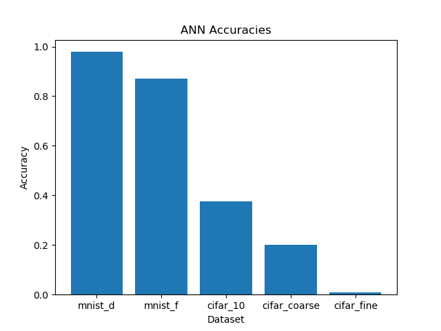
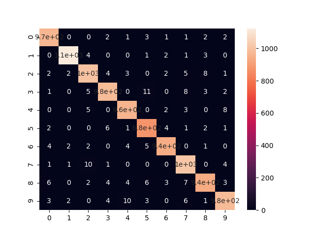
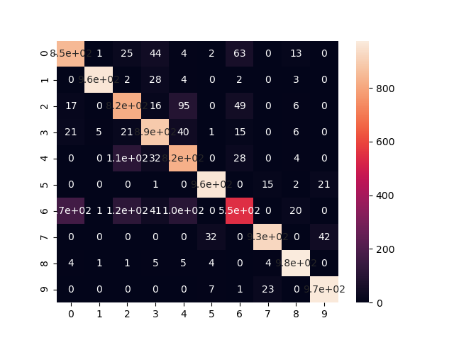
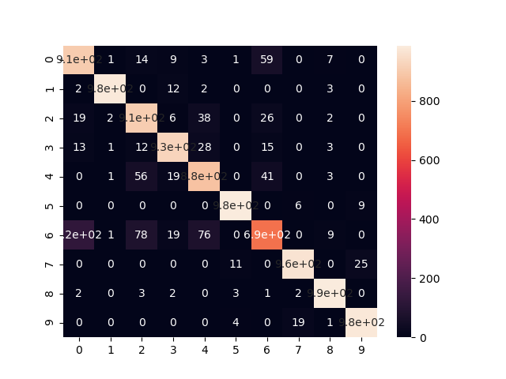
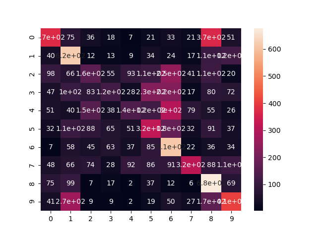
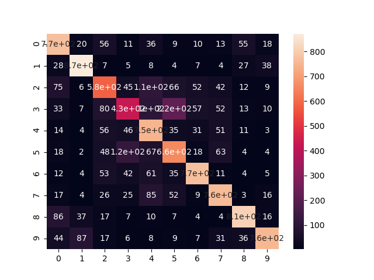
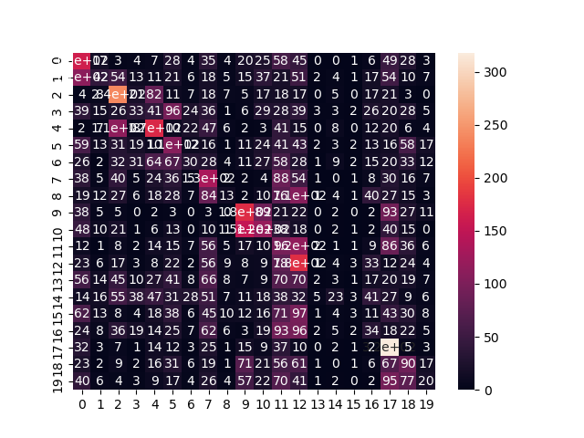
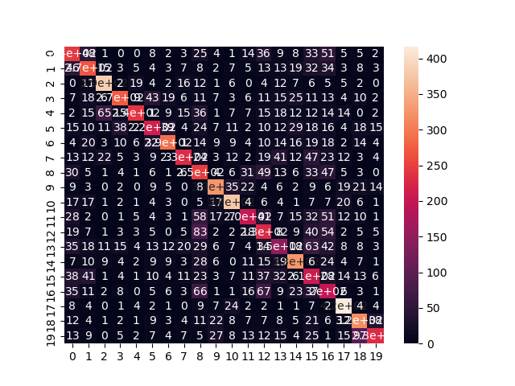
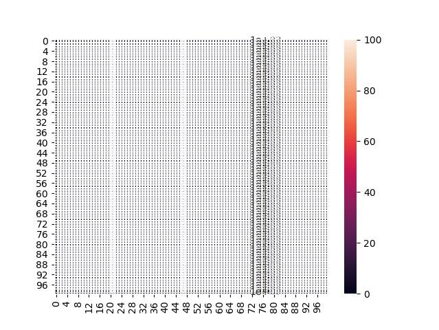
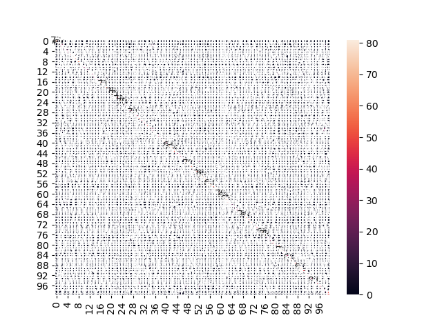

# cs390-lab2
## Name: Rishabh Rajesh
## Email: rajeshr@purdue.edu

 
<h2 style="font-size: 45px">
Report
</h2>

## Background Questions

1. How is a CNN Superior to Standard ANNs for image processing?

**CNNs are superior to ANNs because CNNs have convolution and pooling layers which are trained to extract meaningful features from images which is fed into a feed forward nn (i.e an ANN). As a result, they are superior to ANNs**

2. Why do we sometimes use pooling in CNNs?

**Pooling is sometimes used to reduce the number of values sent to the FFNN while retaining as much information as possible.**

3. Why do you think the cifar datasets are harder than mnist?

**Cifar is harder because they are color images, slightly larger and also have more classes; hence its difficulty.**

## CNN Architectures and Hyperparametes for each dataset

1. MNIST Digits: 2 convpool layers with dropout of 0.25. More specifically, 32,64 filters of size (5,5) and max pooling of (2,2). Afterwards, a flattening layer and a FFNN with 256 neurons in hidden layer, dropout of 0.5 and output layer. The activation function used was relu, with the exception of output layer, which used softmax. Loss function used was categorical cross entropy and optimizer used was the Adam optimizer. Trained for 10 epochs and batch size of 64.

2. MNIST Fashion: Same network as MNIST Digits except with the obvious differences in the input/output layers.

3. Cifar 10: I used a VGG-inspired architecture. The first convpool layer was 32 filters of size (3,3) utilizing a xavier uniform random weight initialization. The pooling layer was size (2,2) and used a stride of 2. There was also a dropout layer of 0.5. The next convpool layer had 2 convolution layers both with 64 filters of size (3,3) and a xavier uniform random weight initialization. There was also a pooling layer of size (2,2) with stride 2 and a dropout of 0.5. Next was the flattening layer and a FFNN. The FFNN had a hidden layer size of 512 neurons, a dropout of 0.5 and the output layer. Just like the MNIST models, the activation function, except for the output (softmax), was relu. The loss function was categorical cross entropy, and the optimizer was Adam. Batch size was 64 and was trained for 20 epochs.

4. Cifar Coarse: The same VGG-Inspired architecture was used for this dataset as well. Batch size was 64 and was trained for 35 epochs.

5. Cifar Fine: The same VGG-Inspired architecture was used for this dataset as well. Batch size was 128 and was trained for 100 epochs. Also there is an extra model I trained, which utilized the data augmentation pipeline.

## Extra Credits:

I added the data augmentation and save model to the pipeline. My accuracy for the Cifar fine also exceeded 45% with an accuracy of 47.72%.

## Results

Accuracy ANN:

Accuracy CNN:

Confusion Matrix for MNIST Digits (ANN):

Confusion Matrix for MNIST Digits (CNN):

Confusion Matrix for MNIST Fashion (ANN):

Confusion Matrix for MNIST Fashion (CNN):

Confusion Matrix for Cifar 10 (ANN):

Confusion Matrix for Cifar 10 (CNN):

Confusion Matrix for Cifar 100 Coarse (ANN):

Confusion Matrix for Cifar 100 Coarse (CNN):

Confusion Matrix for Cifar 100 Fine (ANN):

Confusion Matrix for Cifar 100 Fine (CNN) (notice distinct diagonal line):

## Resources Used

1. Keras API: https://keras.io/api
2. Tensorflow API: https://www.tensorflow.org/api_docs/python
3. VGG (specifically VGG Baseline Block): https://machinelearningmastery.com/how-to-develop-a-cnn-from-scratch-for-cifar-10-photo-classification/

## Link to github repo: https://github.com/rishyraj/cs390-lab2
